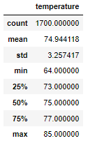
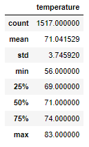

# Surf's Up

## Project Overview
Before W. Avy hastily jumps into a risky business venture, let's analyze the weather data from Oahu to make sure our Shake n' Surf shop will perform well enough there to maintain the costs of moving to Hawaii, and he won't be bankrupt by New Year's Day. 

By using the Hawaii.sqlite file (see 'Resources' folder), we can create a link to the local database and extract the data to perform our analysis. Daily temperatures were retrieved for the months of June and December to compare what the weather will be like in the summer and the winter. 

## Results
Below are two dataframes summarizing the temperatures in Fahrenheit during June and December (June appearing first).

 
 

Relevant data reproduced below;

|              |    June        |    December   |
|    :----:    |    :---:       |    :---:      |
| Mean         | 74.94          | 71.04         |
| Min          | 64             | 56            |
| Max          | 85             | 83            |

There are several key differences between the weather in Oahu in June and December.

- The average temperature during June and December differs by less than 4 degrees. While this is close, it is possible that this shift could be the difference in a customer's decision to buy ice cream or surf on that particular day, but we can rest assured knowing there is little difference between the temperature on an average day in June and an average day in December. 

- June temperatures range by 21 degrees, and in December there is a range of 27 degrees (64-85 and 56-83). As the maximum temperatures recorded in both months are extremely close (only two degrees difference), we can see that both months have fairly similar weather on average, but a visitor can expect a lower range of possible temperatures in December, getting up to 8 degrees colder than the coldest June day. 

- June has a much higher number of recorded temperatures than December does. While there were only 1517 December temperatures in the data, June had 1700. By combing through the date column in our dataframes (see 'SurfsUp_Challenge.ipynb'), we can see that June has data from 2010 to 2017, while December's data ranges from 2010 to 2016. This extra year of data, multiplied by each day of the month and across all stations, adds up to nearly 10% of June's data. While it is not likely that this impacts the analysis very much, as December 2017 is likely to have similar weather when compared to the previous 7 Decembers, we could consider dropping June 2017 or 2010 so that each month has the same number of years. 

## Summary

### What Did We Learn?
As W. Avy gets ready to commit to opening up the Shake n' Surf ice cream surfing shop, he can make an informed decision knowing that the daily temperatures in Oahu do not vary greatly between June and December. The average temperature in December is only 4 degrees lower than in June, and the max temperature is only two degrees lower, meaning that this business venture is sound year-round. The minimum temperature in December is 56 degrees, which may be slightly too cold for casual ice cream fans, but it would not deter true ice cream connoisseurs. Likewise for surfers, the similar temperature across months is not enough to significantly impact the number of customers interested in surfing. He should not expect too much of a dip in sales in the winter months, according to our weather analysis. 

### Future Considerations
Although the temperatures in each month are relatively similar, can December visitors expect more or less rain than June visitors? We can examine the precipitation in the summer and winter. It is possible that a significant change in rainfall would deter customers from surfing or eating ice cream, and W. Avy might want to know this data. 

Another analysis we could perform would involve running the summary statistics for each station. While the averages across all stations are quite similar between June and December, it is possible that there are certain areas with more diverse weather patterns, and W. Avy might want to avoid setting up shop near somewhere that gets much colder in December, or rains significantly more than other stations. In fact, we could find out which station has the highest temperatures, and advise him to open his business near that station. 
